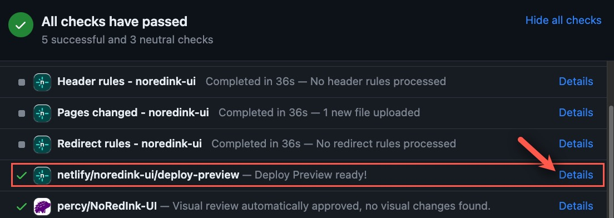

# Ownership, policies, & key concepts

The `noredink-ui` package and the Component Catalog app showcasing its components are currently unowned.

No party is currently responsible for oversight of the foundational aspects of the component library, a.k.a. “**[Component Library Foundations](#component-library-foundations)**.”

Typically, the owner of the component library & catalog would provide guidance and support to developers and designers who are building new components or working with existing components.

[The Component Catalog application can be found here](https://noredink-ui.netlify.app/).

## Component Library Foundations

- Adherence to the component library [accessibility policy](#accessibility-policy)
- Adherence to the [NoRedInk UI Style Guide](https://paper.dropbox.com/doc/UI-Style-Guide-and-Caveats-PvOLxeX3oyujYEzdJx5pu) and [Guidelines for Sharing User-Facing Changes with Design](https://paper.dropbox.com/doc/Guidelines-for-Sharing-User-Facing-Changes-with-Design-bdKGQtYH9qO9I00hUkA6k)
- Interoperability and consistency of components with each other and with the NoRedInk app
- Quality and consistency of API design
- Quality of internal code
- Existence and quality of code documentation for each component
- Existence, quality, and organization of component example pages in [the Component Catalog](https://noredink-ui.netlify.app/)
- Test coverage and testability of each component and of [the Component Catalog](https://noredink-ui.netlify.app/)

## Accessibility policy

- No new components will be added to the component library if they do not conform to [WCAG 2.1 AA accessibility guidelines](https://www.w3.org/WAI/standards-guidelines/wcag/). Similarly, no existing components will be modified such that the component falls out of conformance with these guidelines.
- For new components, UX designers & stakeholders are responsible for making their best faith effort to follow the [Accessibility Guidelines for Product Development](https://paper.dropbox.com/doc/PlcoE22OpOhB6eWCF4rFj?noDesktopRedirect=1) and outside accessibility resources to include accessibility details in their spec and code.
- Existing components that do not conform to [WCAG 2.1 AA accessibility guidelines](https://www.w3.org/WAI/standards-guidelines/wcag/) should be updated to be conformant. (There is [a project of accessibility issues](https://linear.app/noredink/project/[components]-a11y-updates-4405910cf0c9) in the disbanded accessibility team's backlog. Note that after 19 February, 2024, there may be new accessibility problems not captured in that project due to the lack of an accessibility team reviewing component changes.)
- Components in the NoRedInk app which are NOT in the component library but which are shared or could be shared across multiple interfaces may be added to the component library over time by any team, ideally with any necessary accessibility improvements, in accordance with the [`noredink-ui` versioning policy](#versioning-policy).

# Contribution guidelines

## What belongs in the component library?

Assume anything that seems like it should be a shared component should probably be a shared component. The remaining contribution guidelines will help you make this determination.

## How to contribute

The new owner of the component library should update this section and may wish to refer to git history to understand the prior process.

Some suggestions for contributing include the following:

### 🔧 Modifying an existing component

1. Before beginning actual development work, ensure your proposed changes do not cause accessibility regressions or introduce new accessibility issues. Ensure your proposed changes follow accessibility guidelines & best practices.
1. Review the [PR template](/.github/pull_request_template.md) in advance so that you understand contribution requirements in advance, or go ahead and open a draft PR so you can use the [PR template](/.github/pull_request_template.md) as you work.
1. If you are releasing a new major version of a component, be prepared for your team to upgrade all instances of the component anywhere it is used. We recommend creating stories now for this work and linking to them in your PR.
1. The owner of the component library should keep an eye on all noredink-ui updates and may request modifications to your work if it does not adhere to the [Component Library Foundations](#component-library-foundations).

### 🌟 Creating a new component

1. Before beginning actual development work, carefully review existing components and helpers to be sure that there does not already exist something that meets your needs.
1. Before beginning actual development work, ensure your proposed changes do not cause accessibility regressions or introduce new accessibility issues. Ensure your proposed changes follow accessibility guidelines & best practices.
1. Review the [PR template](/.github/pull_request_template.md) in advance so that you understand contribution requirements in advance, or go ahead and open a draft PR so you can use the [PR template](/.github/pull_request_template.md) as you work.
1. Before beginning dev work, we strongly recommend working closely with a UX designer to produce a **clear, comprehensive** component spec. Here are some tips for developing a good spec before starting component work:
   - UX designers & stakeholders are responsible for making their best faith effort at following the [Accessibility Guidelines for Product Development](https://paper.dropbox.com/doc/PlcoE22OpOhB6eWCF4rFj?noDesktopRedirect=1) and outside accessibility resources to include accessibility details in their spec and code.
   - In the spec, include details about which properties need to be configurable and which configuration options are necessary for each property. For example, if your component allows color configurations, you might want developers to specify any hex code as the color, or you may wish to limit them to a particular subset of [NoRedInk's colors](https://noredink-ui.netlify.app/#/doodad/Colors), etc.
1. If you'd like to have multiple small PRs as you build out the functionality of the component, we recommend branching the small PRs off an omnibus-style component-specific branch instead of branching each small PR off of master.
1. For your initial PR, please request a PR review from your team as usual, but also add the owner of the component library as an additional PR reviewer.
   - The owner of the component library will review your PR solely for the purposes of ensuring that your new component adheres to the [Component Library Foundations](#component-library-foundations). The owner of the component library may point out bugs if they happen to find them, but that’s not what they’ll be looking for — **your team is ultimately responsible for testing/coordinating testing of your new component**.
1. It is strongly recommended that you use [the script to add a new component to the Component Catalog](#💫-adding-a-component-to-the-component-catalog).
1. Start creating a [QA Flightplan](https://paper.dropbox.com/doc/QA-landing-page-FAQ--BNKlATfTHdgnJa48lcR5NrVSAg-wLYVa0lEmkaiJB09CXHRn) as if this were a new feature. We recommend requesting that the QA team _at least_ tests your new component within the Component Catalog netlify branch preview. (You can always request additional QA of your component as implemented in the NoRedInk app later.) Simple components may have a simple flightplan, and that’s okay!
1. When you're ready to publish your component, please refer to [the noredink-ui versioning policy](#versioning-policy), which includes guidance on permitted API changes per release.
1. The owner of the component library should keep an eye on all noredink-ui updates and may request modifications to your work if it does not adhere to the [Component Library Foundations](#component-library-foundations).

#### 💫 Adding a component to the Component Catalog

There is a script to help you add your components to the Component Catalog quickly & easily!

Run:
```
$ script/add-example.sh
```

And the script will help you wire up an example page. There will still be some TODOs left for you to fill out. Depending on your component's API, you may also need to adjust the generated code a bit for it to compile.

# Developing, deploying, & versioning

## Getting Started

1. Setup your [development environment](#developing-with-nix)
2. Run some [tests](#tests)
3. Check out [some examples](https://noredink-ui.netlify.app/)

## Developing with Nix

You can develop this package without installing anything globally by using Nix.
To get started, install nix from [nixos.org/nix](https://nixos.org/nix/).

After that's set up in your shell (just follow the instructions at the end of the installation script) you can run `nix-shell` to get a development environment with everything you need.

If you find that inconvenient, try using [`direnv`](https://direnv.net/).
Once that's set up, `echo use nix > .envrc` and then `direnv allow`.
Anytime you enter the project your shell will automatically pick up the right dependencies.

If you find that `direnv` loads too slow, [there are faster loading strategies than the default in their wiki](https://github.com/direnv/direnv/wiki/Nix).

### Working with upstream dependencies

We use `nix flake` to manage Nix dependencies.
It is automatically loaded in the Nix environment.

Here are some things you might need to do:

| Task                                                | Action                                                                                             |
| --------------------------------------------------- | -------------------------------------------------------------------------------------------------- |
| Add a non-npm, non-Elm dependency packaged with Nix | Look in nixpkgs and add to `buildInputs` in `flake.nix`. If it's not in nixpkgs, add a new source. |
| Update all our dependencies                         | `nix flake update`                                                                                 |
| Update Nixpkgs (or only one dependency)             | `nix flake lock --update-input nixpkgs`                                                            |
| See all our dependencies and sources                | Look in `flake.nix` and `flake.lock`                                                               |

## Tests

Run tests with

- `shake test`
- `elm-test`

You can run the Puppeteer tests for only one component by passing the name of the component to the test script, for example: `./script/puppeteer-tests.sh Button`

### CI (Travis)

Travis will run `shake ci` to verify everything looks good.
You can run this locally to catch errors before you push!

## Reviews & preview environments
Follow the PR template to ensure your PR is reviewed by the appropriate parties.

Netlify provides a preview environment on the web for each PR. You can share the preview environment URL to allow anyone to preview your changes, even if they don't run local code. This allows for easy functional and visual non-code reviews.

To access the preview environment URL, look in the CI area of your PR for the "deploy preview" row. The "Details" link is the preview environment URL. The URL will be something like `https://deploy-preview-PrIdNum--noredink-ui.netlify.app/`



## Examples

This repo contains an app showcasing all of these UI widgets.

To see them locally:

```
script/develop.sh
```

And go to http://localhost:8000/

If you'd like to test your widget in the monolith before publishing, run `script/test-elm-package.py ../path_to_this_repo` from the monolith's directory.

## Publishing a new version

Any NoRedInk engineer can deploy a new version of `noredink-ui`. Generally, we prefer to do a release after every change, rather than trying to batch changes together. This is mostly to make QA more straightforward -- especially for the cases where we make a mistake!

- Make a bump PR
  - Make a new branch off of latest master
  - Run `elm diff` and verify that the changes are not major ([versioning policy](https://github.com/NoRedInk/noredink-ui/blob/master/README.md#versioning-policy)) and are what you expect. Copy the diff (you'll paste it into a PR description later.)
  - Run `elm bump`
    - Getting a "PROBLEM LOADING DOCS" error? See [troubleshooting a release](https://github.com/NoRedInk/noredink-ui/blob/master/README.md#troubleshooting-a-release)
  - Commit the changes to the `elm.json` file
  - Make a PR and fill out the PR template (this is when you'll paste in the diff you copied earlier!)
- Get your PR merged
- Go to latest master
  - `git checkout master`
  - `git pull`
- Run `elm publish` and follow its prompts
  - Note: when you're asked to create a version tag, **please be sure to include a meaningful message**! Include details in the message that describe why this noredink-ui version exists at all.
  - Create an annotated tag like this:
  ```
  git tag -a 22.x.y -m "Description of this release version: i.e.: 'high-contrast mode highlight style change'"
  ```
  - Because of branch protection you will not be able to push a tag like: `git push origin master 22.x.y` (The previous command requires permissions to push directly to master even if you have no changes).
  - Instead, please push your new `22.x.y` tag with the following: `git push origin 22.x.y`

Once you've published, you should see the latest version at <https://package.elm-lang.org/packages/NoRedInk/noredink-ui/>. It can take a few minutes to show up.

### Troubleshooting a release

If you get something like this:

```
-- PROBLEM LOADING DOCS --------------------------------------------------------

I need the docs for 12.17.0 to compute the next version number, so I fetched:

    https://package.elm-lang.org/packages/NoRedInk/noredink-ui/12.17.0/docs.json

I got the data back, but it was not what I was expecting. The response body
contains 195076 bytes. Here is the beginning:

    [{"name":"Nri.Ui","comment":" A collection of helpers for working with No...

Does this error keep showing up? Maybe there is something weird with your
internet connection. We have gotten reports that schools, businesses, airports,
etc. sometimes intercept requests and add things to the body or change its
contents entirely. Could that be the problem?
```

Then run it with 0.19.0 explicitly (0.19.1 has some problems with big docs):

```
npx -p elm@0.19.0-no-deps elm bump
```

If you encounter issues with using npx, you can manually download and use the Elm 0.19.0 binary as an alternative:

- [Download the Elm 0.19.0 binary for Mac](https://github.com/elm/compiler/releases/download/0.19.0/binaries-for-mac.tar.gz)
- Extract the file into your project directory.
- Right-click on it, select "Open" from the context menu, and give the necessary permissions for it to run. Note that double-clicking on the file will not request the necessary permissions.
- Run `./elm bump`

## Versioning policy

We try to avoid breaking changes and the associated major version bumps in this package. The reason for that is to avoid the following scenario:

```
  |
  x   4.6.0: Adding RadioButton widget
  |
  x   5.0.0: Breaking change in the TextArea widget
  |
  x   5.0.1: Styling fix in the Checkbox widget
  |
```

Suppose you just released version `5.0.1`, a small styling fix in the checkbox widget, for a story you're working on. If the project you're working in currently pulls in `noredink-ui` at version `4.x`, then getting to your styling fix means pulling in a new major version of `noredink-ui`. This breaks all `TextArea` widgets across the project, so those will need to be fixed before you can do anything else, potentially a big effort.

To prevent these big Yaks from suddenly showing up in seemingly trivial tasks we prefer to avoid breaking changes in the package. Instead when we need to make a breaking change in a widget, we create a new module for it `Nri.Ui.MyWidget.VX`. Similarly, when we build custom elements in JavaScript we create a file `lib/MyWidget/VX.js` and define a custom element `nri-mywidget-vX`.

That said, we may prune unused modules occasionally.

We should change this process if we feel it's not working for us!
